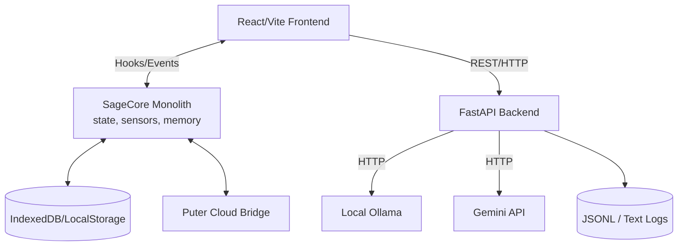
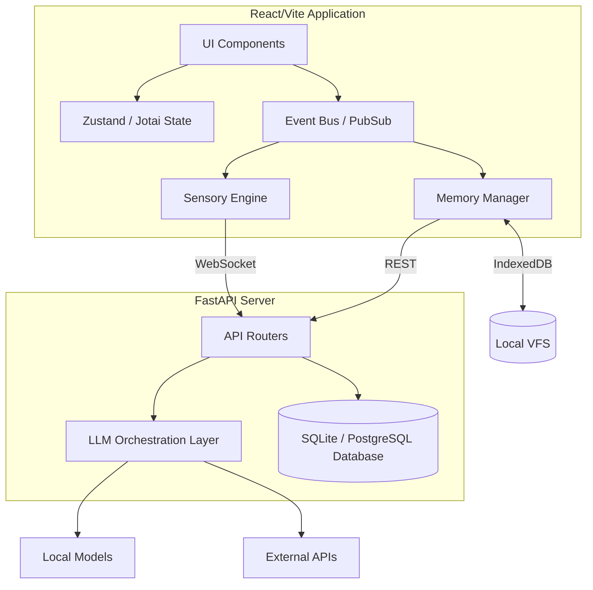

# Deep Analysis: AI Studio Applet Performance & Architecture

This document serves as a comprehensive analysis of the AI Studio Applet (`SAGE-7` platform). It focuses on identifying performance bottlenecks and architectural areas of improvement across both the React frontend and Python/FastAPI backend.

---

## 1. Performance Bottlenecks

### 1.1 Frontend Performance

**1. High-Frequency State Updates (React `useState` in `useNexusState.ts`)**
The `useNexusState` hook currently drives the UI with two extremely fast intervals:
- **Sensor Polling (5Hz):** The `updateInterval` executes every 200ms. It not only calculates randomized dummy state but forces React to re-render any component connected to `meters` and directly pushes data to the `SageCore` via `core.updateSensorData()`.
- **Anomaly Polling (0.2Hz):** Runs every 5 seconds, mutating `anomalyLevel`.
*Impact:* This 5Hz state mutation is highly taxing on React's rendering lifecycle. While the `historiesRef` successfully avoids re-renders for the array history, `setMeters` still forces a re-render of components using these metrics.
*Improvement:* Migrate high-frequency sensor streams out of React `useState`. Components that display real-time metrics should either subscribe to `SageCore` events directly or utilize Canvas/WebGL rendering for the data graphs (`QuartzBarChart`, etc.) rather than DOM-based React nodes that update every 200ms.

**2. Synchronous LocalStorage/IndexedDB interactions**
Within `sage-core.ts`, memory management uses asynchronous `IndexedDB` interactions nicely in some places (e.g., `stash()`), but fallback mechanisms heavily rely on `localStorage` synchronously.
*Impact:* LocalStorage blocking on the main thread during high-frequency chat updates or state saving can induce UI jank.

**3. Next.js to Vite Migration Leftovers**
The use of `'use client'` directives (e.g., `src/App.tsx`, `src/hooks/use-nexus-state.ts`, `src/components/NexusPlatform.tsx`) suggests a migration from Next.js to Vite. While harmless in Vite, it adds unnecessary noise.
Additionally, the dynamic imports in `NexusPlatform.tsx` use React `lazy` and `Suspense`, but all components are loaded eagerly depending on state. This can be optimized by pre-loading common screens.

### 1.2 Backend Performance

**1. Synchronous File I/O (`server.py`)**
In `server.py`, the `WELLBEING_LOG` append logic uses synchronous blocking I/O:
```python
with open(log_path, "a") as f:
    f.write(json.dumps(entry) + "\n")
```
*Impact:* Since FastAPI runs on an asynchronous event loop, blocking I/O like `open().write()` will halt the event loop, causing requests to queue up and increasing latency, especially under load.
*Improvement:* Use `aiofiles` for asynchronous file writing, or offload the writing to a background task (e.g., `asyncio.to_thread` or FastAPI's `BackgroundTasks`).

**2. Chat Endpoint (`/sage/chat`) Latency**
The `chat` endpoint makes an HTTP call to a local Ollama instance (`127.0.0.1:11434/api/chat`).
*Impact:* While the HTTP client (`httpx.AsyncClient`) is async, there's no streaming back to the client (`stream: False`). This means the user must wait for the entire generation to complete before seeing any output.
*Improvement:* Implement Server-Sent Events (SSE) or WebSockets to stream the LLM response back to the frontend in real-time, greatly improving perceived performance and UX.

**3. Unhandled Exceptions in Catch Blocks**
In `/sage/chat`:
```python
except: return {"reply": "Substrate friction detected. Phi maintained."}
```
*Impact:* Bare `except:` clauses mask underlying issues (like timeouts, connection resets, or local model failures). This makes debugging incredibly difficult. It should log the actual error.

---

## 2. Architecture Improvements

### 2.1 State Management & Separation of Concerns

The `SageCore` (in `sage-core.ts`) is a massive monolith (1,141 lines long). It attempts to handle:
- Memory management (VFS, IndexedDB, LocalStorage)
- LLM interaction and prompt formatting
- Sensor data ingestion and analysis
- Event emitting
- Dream states and cognitive architecture

*Proposed Architecture:*
Implement a Domain-Driven Design (DDD) approach. Split `SageCore` into specialized micro-services/classes:
1.  **`MemoryManager`**: Handles IndexedDB, Google Tasks API bridges, and Puter sync.
2.  **`SensoryEngine`**: Manages EMF, Temp, Ion data and triggers anomaly checks.
3.  **`CognitiveEngine`**: Interfaces with LLMs (Ollama, Gemini) and handles prompt generation/consensus.
4.  **`EventBus`**: A centralized Pub/Sub system replacing the monolithic inheritance of `EventEmitter`.

### 2.2 Data Persistence Strategy

Currently, the system relies heavily on `jsonl` and raw `json` files on the backend, alongside `IndexedDB` and `localStorage` on the frontend, plus a bridge to Puter.js cloud storage.
*Critique:* The lack of a formalized database (like SQLite, PostgreSQL, or even a robust document store like MongoDB/TinyDB) makes querying memories or historical data extremely inefficient. The backend relies on in-memory arrays (`WELLBEING_LOG`) that are appended to text files. If the server restarts, only the last state is read (or in the case of `WELLBEING_LOG`, it starts empty and only appends).
*Improvement:* Introduce SQLite using SQLAlchemy or SQLModel for the backend. This gives acid compliance, structured schemas, and fast querying for memories and logs.

### 2.3 Backend Tooling & AI Agent Integrations

The backend uses `AgnoAgent` for coding tasks and direct `httpx` calls for Gemini Vision/Audio and local Ollama.
*Improvement:* Unify the AI interaction layer. Use a robust framework like LangChain or LlamaIndex to standardize how the system interacts with various models (Gemini, Ollama, Claude), rather than writing raw `httpx` wrappers for each endpoint.

---

## 3. Architecture Diagrams

### Current Architecture (High Level)



### Proposed Architecture


